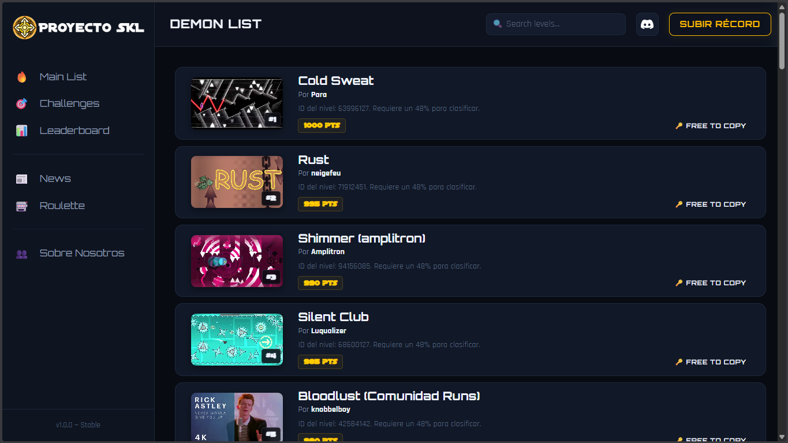

# Proyecto SKL

Una lista creada por la comunidad para recopilar *Extreme Demons* completados dentro de la comunidad de un streamer.

A community-driven list made to archive and showcase completed *Extreme Demons* from a streamer's community.

---

## 📌 ¿Qué es Proyecto SKL?

Proyecto SKL es una página inspirada en las famosas *Demon Lists* de Geometry Dash, enfocada en recopilar los *Extreme Demons* completados por la comunidad.

La página incluye diferentes sistemas y apartados creados para que la comunidad pueda participar activamente:

* 🏆 Lista principal de Extreme Demons
* ⚡ Apartado de Challenges
* 👥 Leaderboard de jugadores
* 📤 Sistema para subir challenges
* 🎮 Diseño inspirado en la comunidad de Geometry Dash
* 🌐 Página accesible desde navegador

## 🚀 Características

### 📜 Main List

La lista principal recopila niveles considerados relevantes dentro de la comunidad.

### ⚡ Challenges

Los usuarios pueden crear y enviar challenges personalizados para formar parte de la página.

### 🏅 Leaderboard

Sistema de clasificación para mostrar el progreso y la participación de los jugadores.

### 🌍 Comunidad

Proyecto creado principalmente para la comunidad hispanohablante de Geometry Dash.

## 🛠 Tecnologías utilizadas

* HTML
* CSS
* JavaScript

## 🌐 Página web

[Los respectivos creditos e inspiraciones están dentro de la pagina en el apartado "Sobre Nosotros"](https://proyecto-skl.github.io/-proyecto-skl-/#about)

👉 [inicio de la pagina - https://proyecto-skl.github.io/-proyecto-skl-/#mainlist](https://proyecto-skl.github.io/-proyecto-skl-/#mainlist)

## 📷 Capturas

## 📌 Objetivo del proyecto

El objetivo de Proyecto SKL es ofrecer un espacio donde la comunidad pueda:

* Compartir logros
* Competir amistosamente
* Publicar challenges
* Mantener registros organizados
* Expandir la interacción entre jugadores

## 🤝 Contribuciones

Las contribuciones, sugerencias e ideas son bienvenidas.

Si quieres ayudar al proyecto:

1. Habla con el dueño o editor (Hank y vargas, se encuentran en el discord de la comunidad)
2. Explica tus cambios

---

